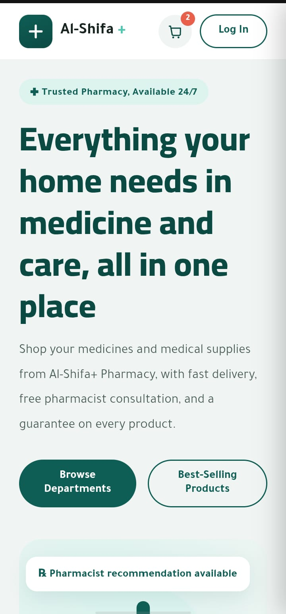
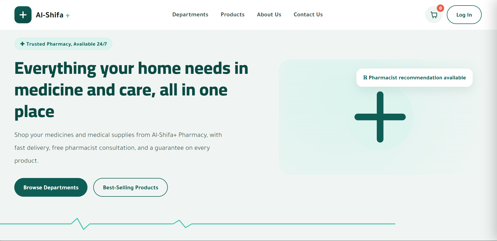
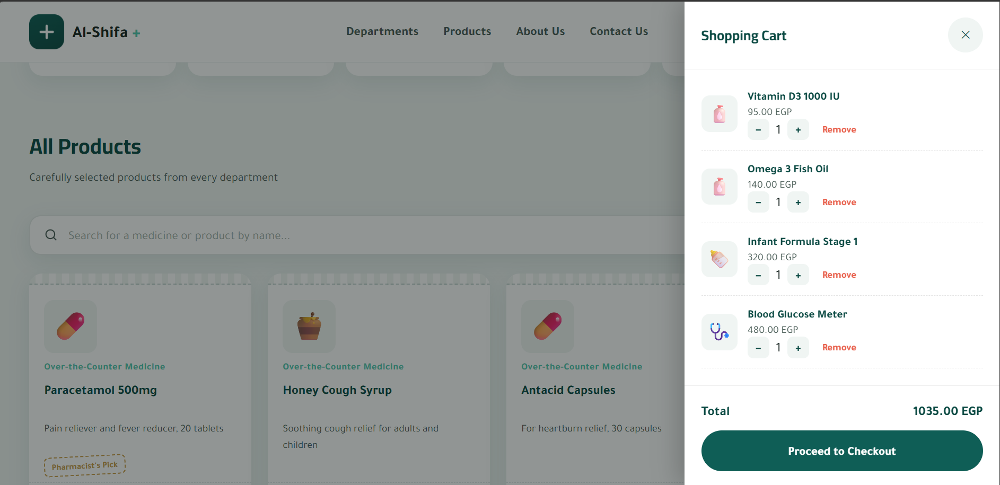
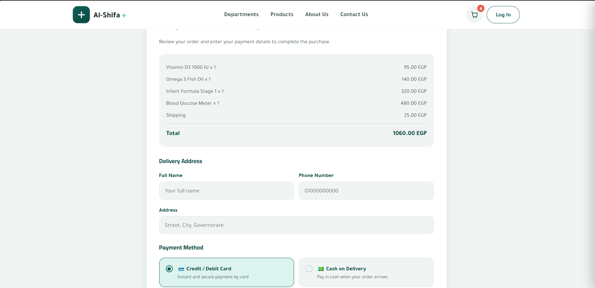
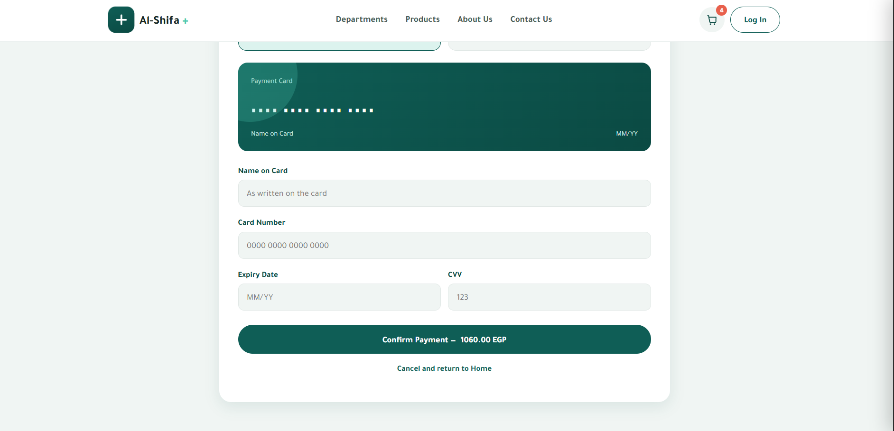
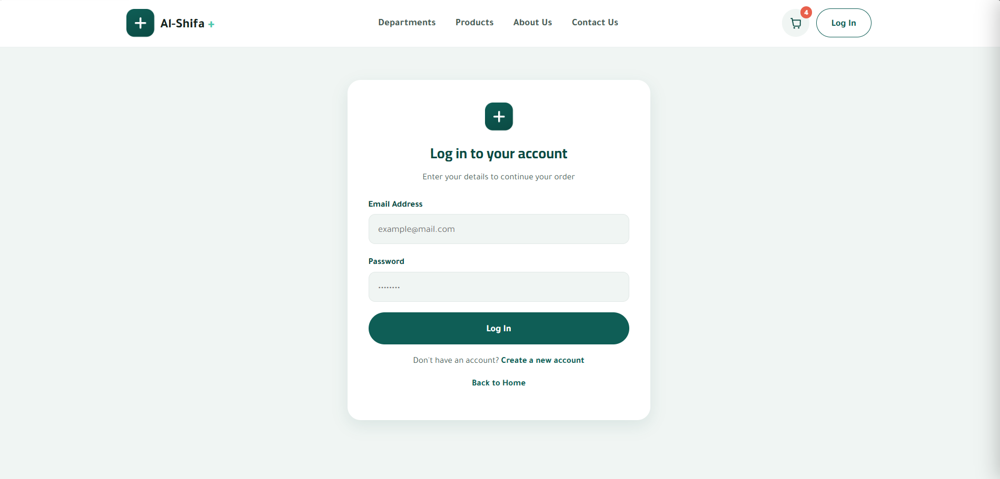

# pharmacy-spa-app

Modern, highly responsive Pharmacy E-commerce Single Page Application (SPA) built with pure Vanilla JavaScript, HTML5, and CSS3. Features cart system, local storage, search, and checkout.

---

## 🟢 تطبيق صيدلية الشفاء+ الإلكترونية | متجر تفاعلي متكامل (Vanilla JS / SPA)

هل تبحث عن واجهة متجر إلكتروني سريعة، سلسة، وتعمل بكفاءة عالية دون الاعتماد على مكتبات ثقيلة؟

**مشروع "صيدلية الشفاء+"** هو منصة صيدلية متكاملة مصممة بنظام الصفحة الواحدة (SPA)، تمنح المستخدم تجربة تسوق فائقة السرعة مع واجهة مستخدم (UI/UX) حديثة ومخصصة بالكامل للقطاع الطبي.

### ✨ أبرز مميزات المشروع:
* **تصفح فوري (Single Page Application):** التنقل بين الأقسام، تسجيل الدخول، وصفحة الدفع يتم بسلاسة تامة ودون الحاجة لإعادة تحميل الصفحة.
* **سلة مشتريات تفاعلية وحفظ آلي:** إمكانية تعديل الكميات وحساب الإجمالي تلقائياً، مع حفظ عناصر السلة في الذاكرة المحلية (`localStorage`) حتى لا تضيع بيانات العميل.
* **بحث وتصفية ذكية:** فلترة المنتجات حسب القسم العلمي أو البحث الفوري بالاسم والوصف.
* **تعدد وسائل الدفع:** دعم الدفع بالبطاقات المباشرة (مع نموذج معاينة تفاعلي للبطاقة) والدفع عند الاستلام (COD).
* **تصميم عصري ومتجاوب 100%:** يدعم جميع الشاشات (الهاتف، التابلت، الحاسوب) مع حركات أنيميشن طبية مخصصة مثل نبض Heartbeat ورسم EKG.
* **كود نظيف وسريع:** مبرمج باستخدام Pure Vanilla JavaScript ES6 لضمان أقصى سرعة أداء وخفة في التحميل.

💡 *يمكن تخصيص وتطوير هذا النموذج ليناسب أي نوع من المتاجر أو الصيدليات أو الخدمات الطبية بسهولة.*

---

## 🔵 Al-Shifa+ E-Pharmacy Web Application | Interactive SPA (Vanilla JS)

Looking for a lightning-fast, sleek, and highly performant e-commerce interface built without heavy external dependencies?

**Al-Shifa+ Pharmacy** is a complete, fully responsive Single Page Application (SPA) designed to deliver a seamless shopping experience tailored specifically for the healthcare and retail sector.

### ✨ Key Highlights & Capabilities:
* **Seamless SPA Navigation:** Instant screen transitions between Products, Login, Checkout, and Confirmation without page reloads.
* **Interactive Cart & LocalStorage:** Real-time total calculation, quantity control, and state persistence via `localStorage`.
* **Smart Filter & Live Search:** Instant product filtering by category and quick multi-field search bar.
* **Multi-Payment Gateway Integration:** Includes live interactive credit card formatting/preview and Cash-on-Delivery (COD) support.
* **Medical-Grade UI/UX:** Features modern styling, custom CSS EKG signature pulse animations, and custom brand identity.
* **Clean, High-Performance Codebase:** Built with Vanilla HTML5, CSS3, and modern ES6 JavaScript for maximum speed and SEO optimization.
  ---

## 📸 App Screenshots - لقطات الشاشة

### 📱 Responsive Mobile View

### 💻 Desktop Overview & Features
| Home Page | Interactive Cart Drawer |
| :---: | :---: |
|  |  |

| Checkout & Order Summary | Interactive Card Payment |
| :---: | :---: |
|  |  |

### 🔐 Auth Page

